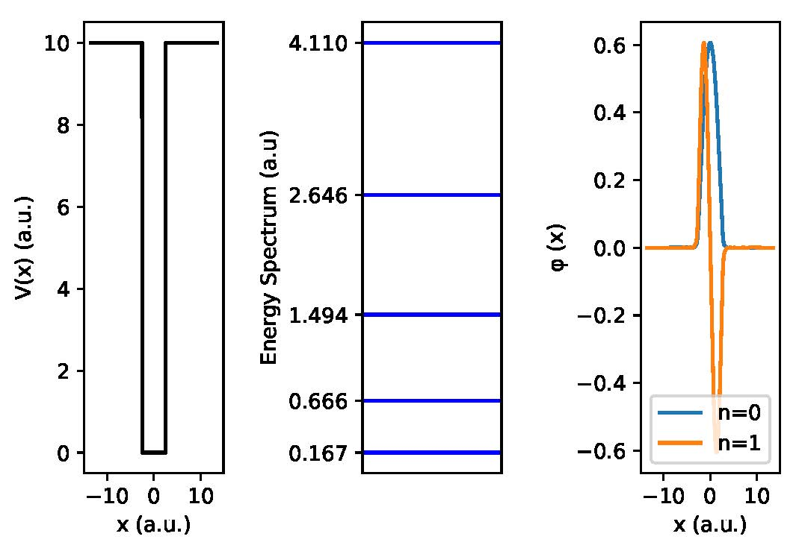
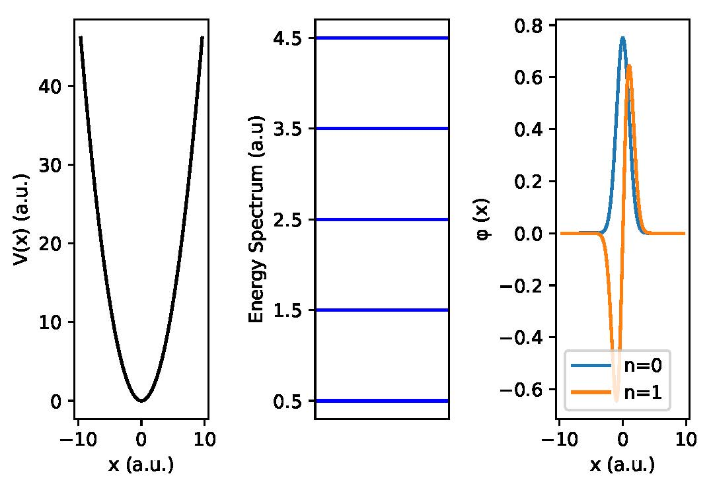
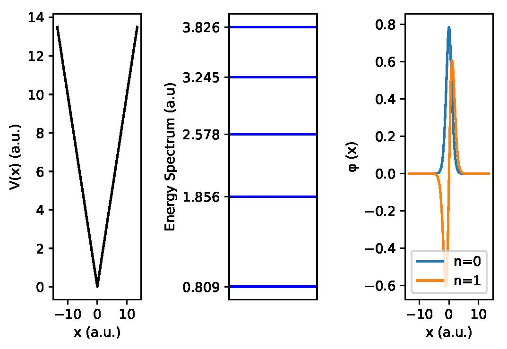
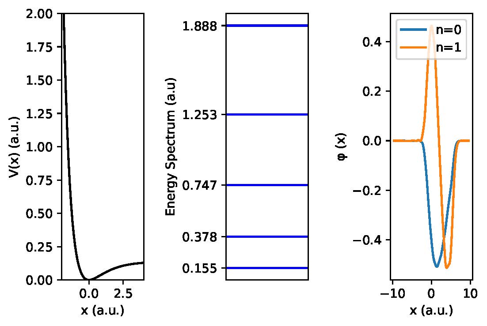

# Python-Numerical-Solutions-to-1D-Schroedinger-Equation.-II
Solutions to the 1D time-independent Schroedinger equation with arbitrary potential function allowing bound states

Solve eigenenergies and eigenfunctions by diagonaliznig the Hamiltonian. Please refer to the readme.pdf file for theory.

The user can modify the potential function inside the code to try different functions. 
The size of the basis can be increased in order to obtain more accurate results.

The following potentials are considered:
1. 1D finite square well
2. 1D Harmonic oscillator
3. 1D V-shape potential
4. 1D Morse potential

